# iTServicePro - Plataforma de Servicios Profesionales

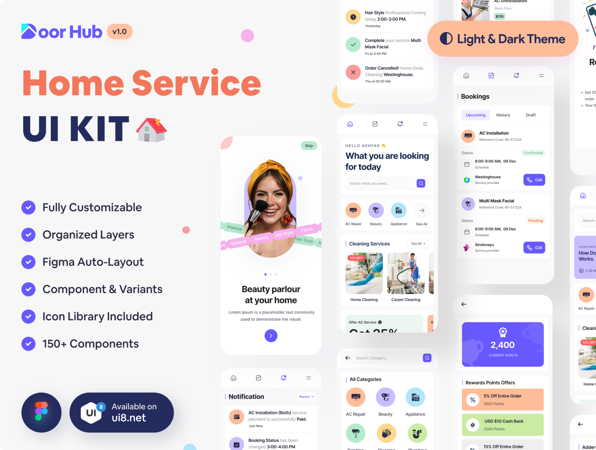

iTServicePro es una aplicación móvil integral de servicios profesionales con un diseño limpio y moderno. La aplicación cuenta con soporte para modo claro y oscuro con esquemas de color globales consistentes y tipografía. iTServicePro proporciona una arquitectura bien estructurada, diseño pixel-perfect y componentes organizados para una experiencia de usuario perfecta. 100% escalable y personalizable.

Alejandro Vallejo Parra (AleRxJ)  
**Repositorio:** https://github.com/AleRxJ/iTServicePro

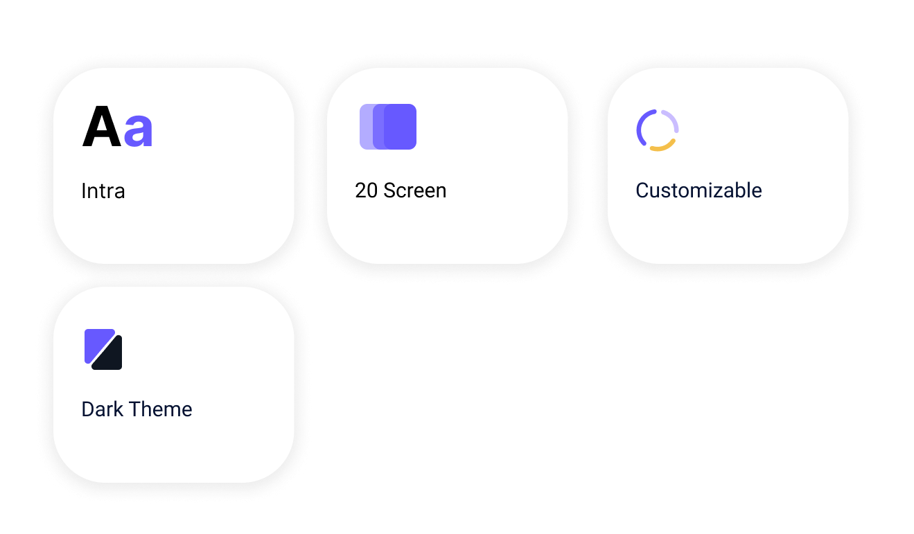

## Paleta de Colores 🎨
*Esquema de colores personalizado y único*

<br>
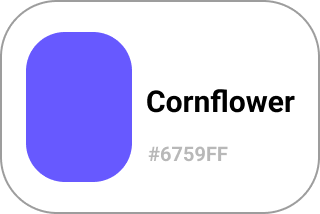
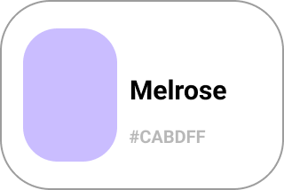
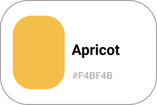
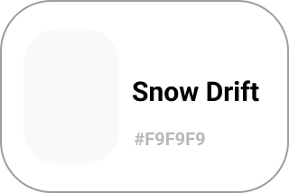
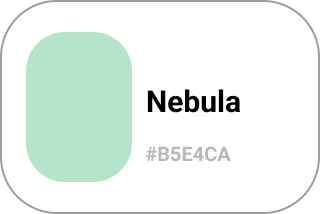
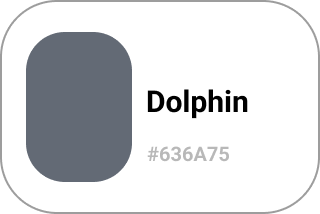
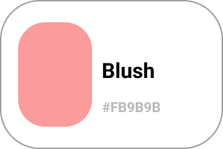
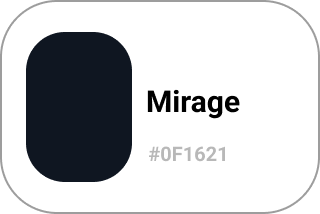

<br>
<br>
<br>
<br>
<br>
<br>


## Pantallas de la Aplicación 📱
*Diseño original y personalizado*

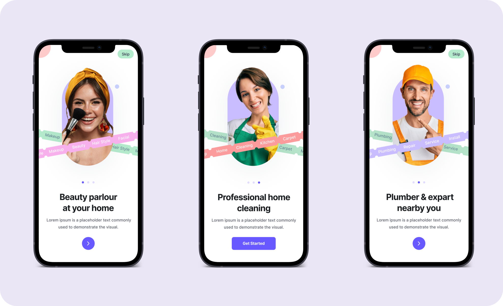
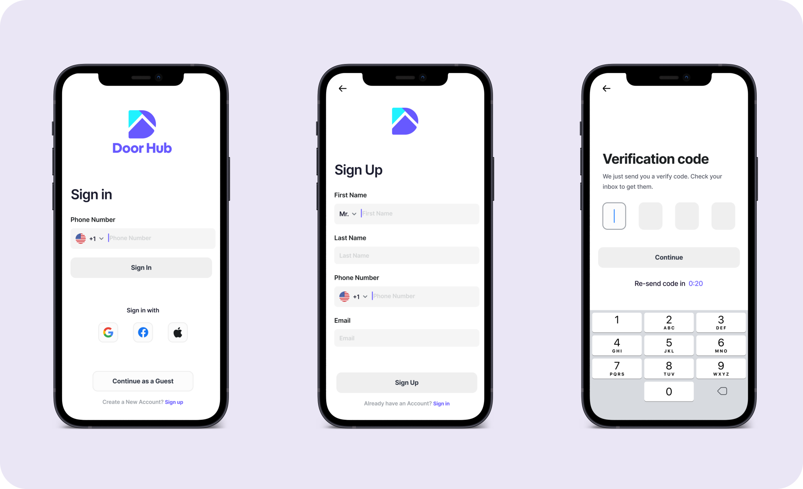
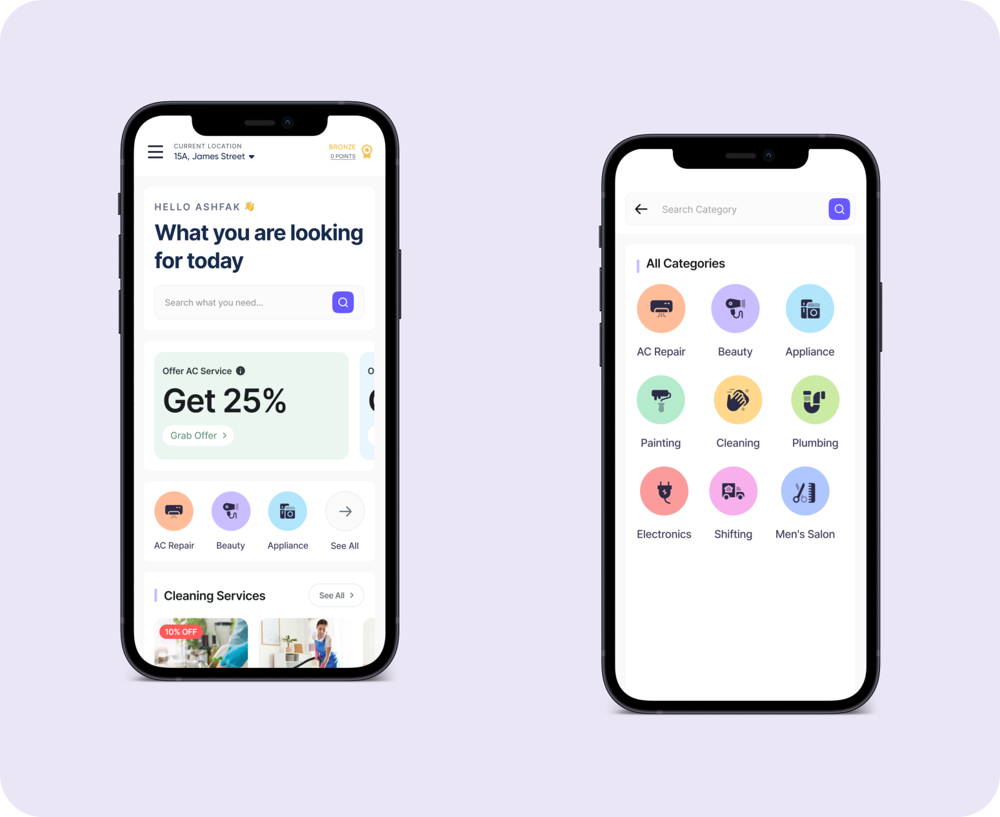
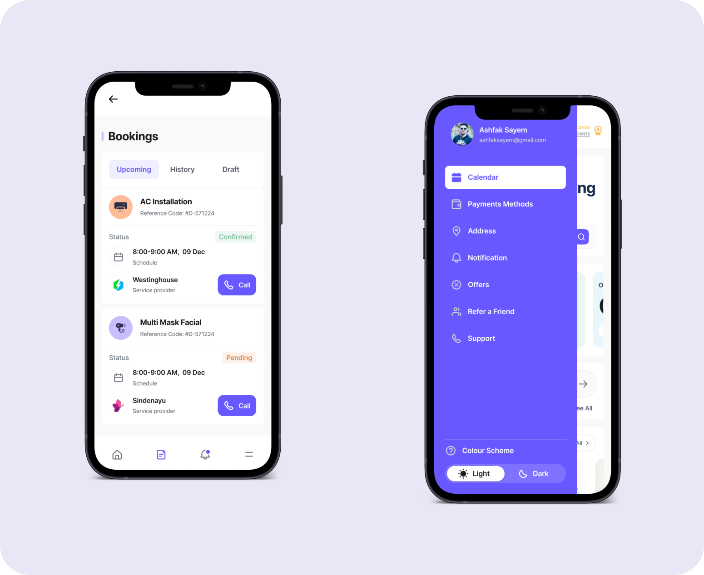

<br>

## Tecnologías Implementadas 🛠️
*Stack tecnológico moderno y optimizado*

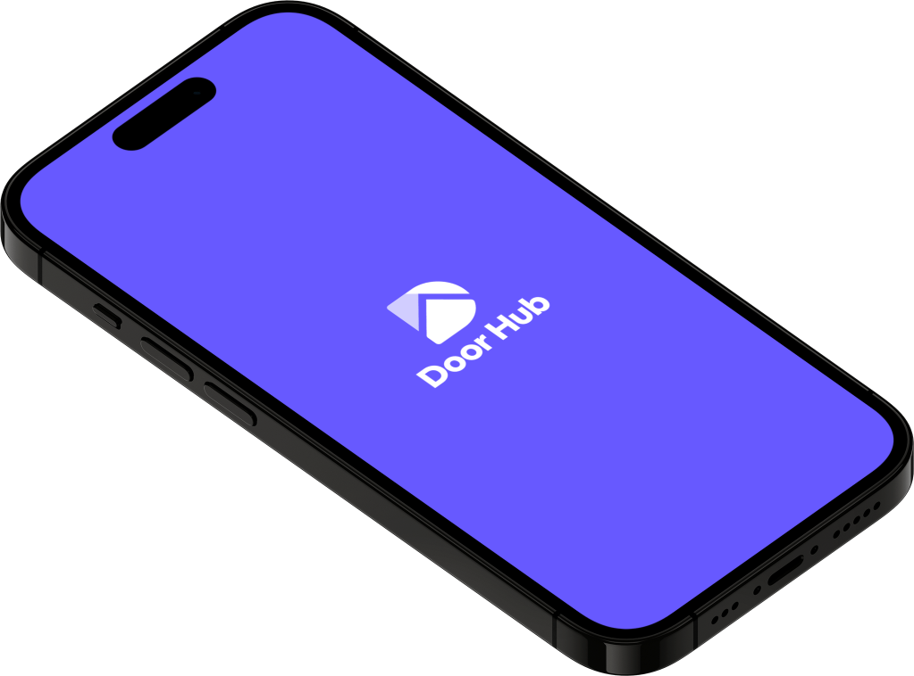

### Desarrollo Móvil
- **Flutter 3.x** - Framework principal para desarrollo multiplataforma
- **Dart** - Lenguaje de programación principal
- **SDK mínimo nivel 21** - Compatibilidad con Android moderno

### Arquitectura y Patrones
- **MVC (Model-View-Controller)** - Patrón arquitectónico principal
- **Arquitectura limpia** - Separación clara de responsabilidades
- **Programación reactiva** - Para interfaces dinámicas

### Gestión de Estado y Navegación
- **[GetX](https://pub.dev/packages/get)** - Solución completa para gestión de estado, navegación y dependencias
- **[get_storage](https://pub.dev/packages/get_storage)** - Almacenamiento local rápido y sincronizado

### Interfaz de Usuario
- **[animations](https://pub.dev/packages/animations)** - Animaciones pre-construidas para efectos visuales
- **[Flutter Screen Util](https://pub.dev/packages/flutter_screenutil)** - Diseño responsivo basado en densidad de píxeles
- **[smooth_page_indicator](https://pub.dev/packages/smooth_page_indicator)** - Indicadores de página personalizables y animados

### Funcionalidades Especializadas  
- **[table_calendar](https://pub.dev/packages/table_calendar)** - Calendario altamente personalizable
- **[carousel_slider](https://pub.dev/packages/carousel_slider)** - Carruseles de imágenes personalizables
- **[credit_card_scanner](https://pub.dev/packages/credit_card_scanner)** - Escáner de tarjetas de crédito y débito

### Recursos y Tipografía
- **[google_fonts](https://pub.dev/packages/google_fonts)** - Fuentes gratuitas de Google Fonts
- **[flutter_svg](https://pub.dev/packages/flutter_svg)** - Renderizado de gráficos vectoriales SVG

### Configuración de App
- **[flutter_native_splash](https://pub.dev/packages/flutter_native_splash)** - Splash screen nativo personalizado
- **[flutter_launcher_icons](https://pub.dev/packages/flutter_launcher_icons)** - Iconos de launcher personalizados

## Características Principales 🚀

### Funcionalidades de Usuario
- ✅ **Sistema de autenticación** completo
- ✅ **Reserva de servicios** profesionales  
- ✅ **Gestión de pagos** integrada
- ✅ **Chat de soporte** en tiempo real
- ✅ **Sistema de calificaciones** y reseñas
- ✅ **Gestión de perfiles** personalizados
- ✅ **Notificaciones push** inteligentes
- ✅ **Geolocalización** y mapas integrados

### Experiencia de Usuario
- 🎨 **Modo claro/oscuro** automático
- 📱 **Diseño responsivo** para todos los dispositivos
- ⚡ **Animaciones fluidas** y micro-interacciones
- 🔄 **Modo offline** con sincronización automática
- 🌍 **Soporte multi-idioma** (preparado)

### Plataformas Soportadas
- 📱 **Android** (SDK 21+)
- 🍎 **iOS** (compatible)
- 💻 **Windows** (desktop)

## Instalación y Uso �

### Prerrequisitos
- Flutter 3.0 o superior
- Dart 3.0 o superior
- Android Studio / VS Code
- Git

### Pasos de instalación
```bash
# Clonar el repositorio
git clone https://github.com/AleRxJ/iTServicePro.git

# Navegar al directorio del proyecto
cd iTServicePro

# Instalar dependencias
flutter pub get

# Ejecutar la aplicación
flutter run
```

### Configuración adicional
```bash
# Generar iconos de launcher
flutter pub run flutter_launcher_icons

# Generar splash screen
flutter pub run flutter_native_splash:create
```

## Autor y Contribuciones 👨‍💻

**GitHub:** [@AleRxJ](https://github.com/AleRxJ)  
**Proyecto:** iTServicePro - Plataforma de Servicios Profesionales

### ¿Quieres contribuir?
Las contribuciones, problemas y solicitudes de características son bienvenidas. Siéntete libre de revisar la [página de issues](https://github.com/AleRxJ/iTServicePro/issues).

## Licencia 📄

Este proyecto está licenciado bajo la Licencia MIT - consulta el archivo [LICENSE](LICENSE) para obtener más detalles.

---

**💡 ¿Te gusta el proyecto?** ¡Dale una ⭐ en GitHub!